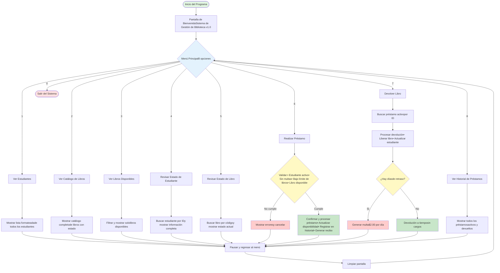

# Resolución del laboratorio de Programación Estructurada

## Descripción del Proyecto
Sistema de Gestión de Biblioteca Escolar desarrollado en JavaScript con Node.js.

## Diagrama de Flujo General

## Funcionalidades del Sistema
- Gestión de estudiantes
- Catálogo de libros
- Sistema de préstamos
- Control de devoluciones
- Cálculo automático de multas
- Historial de transacciones

## Tecnologías Utilizadas
- JavaScript
- Node.js
- Módulo readline para interfaz CLI